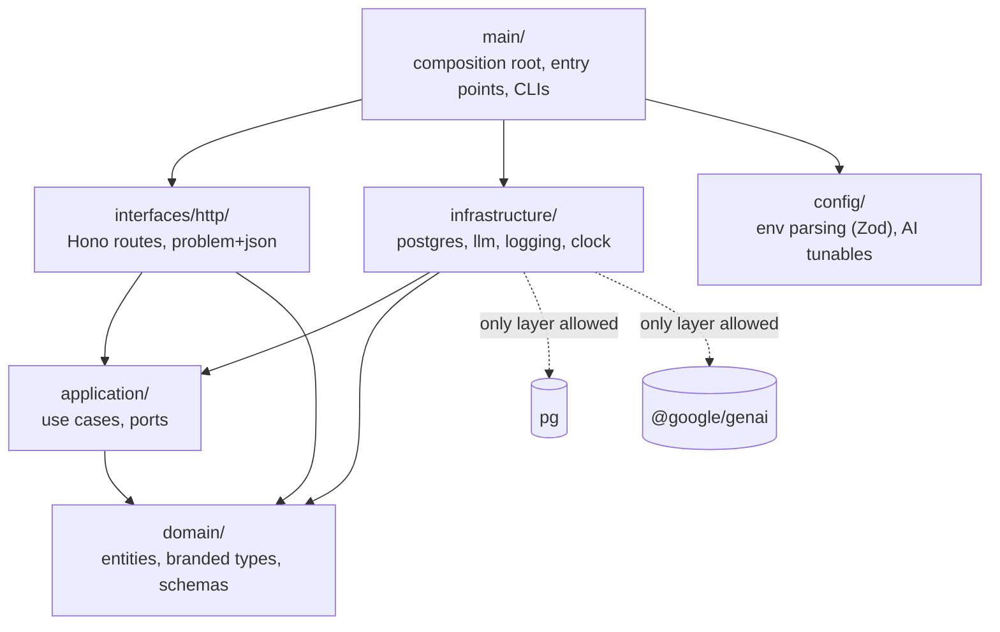
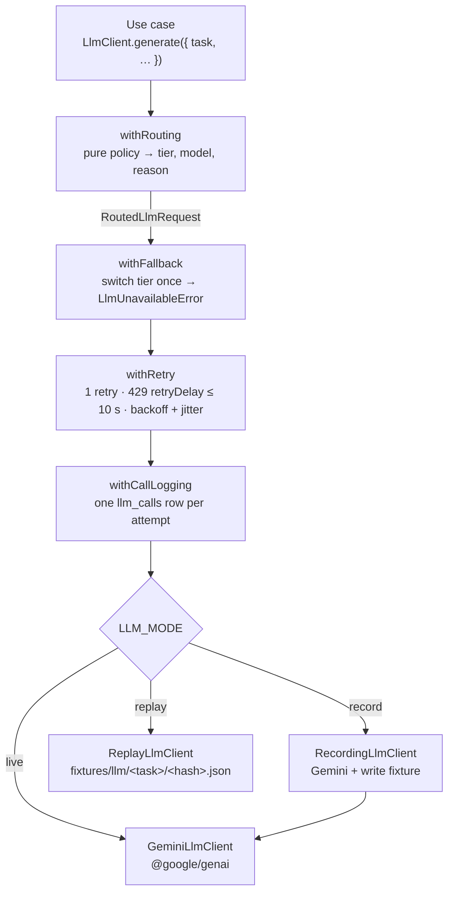
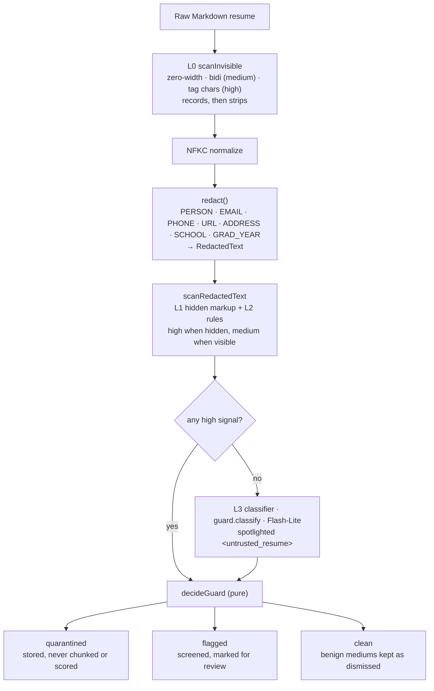

# Architecture

How HireSignal is put together. Decisions are in the [ADR index](adr/README.md), and the full design is in [SPEC.md](SPEC.md). This page grows phase by phase; as of 2026-10-09 (Phase 2) it covers the system context, the API layers, the LLM platform and the data model.

## System context

- **One Lambda behind a Function URL** serves the whole API ([ADR 0004](adr/0004-single-lambda-behind-a-function-url.md)). The web app is a static SPA on Amplify ([ADR 0017](adr/0017-static-spa-on-amplify-with-ci-deploys.md)).
- **One Postgres database** holds the relational data, the JSONB documents, the vectors and the full-text indexes ([ADR 0005](adr/0005-neon-postgres-pgvector-only-datastore.md)). The Lambda connects as the least-privilege `hiresignal_app` role through Neon's pooler. Migrations run as the owner on the direct endpoint, **before** each code deploy ([ADR 0018](adr/0018-forward-only-migrations-before-deploy.md)).
- **The Gemini API** is reached only through the [LLM platform](#llm-platform): Flash-Lite and Flash for generation, `gemini-embedding-2` for embeddings ([ADR 0007](adr/0007-embedding-model-dimensions-and-normalization.md)). CI and tests replay recorded responses and never call it ([ADR 0009](adr/0009-record-replay-llm-adapter.md)).

## API layers

The API is hexagonal ([ADR 0002](adr/0002-hexagonal-architecture-with-enforced-boundaries.md)). [`.dependency-cruiser.cjs`](../.dependency-cruiser.cjs) enforces the arrows in CI.

Persistence follows ports and adapters ([ADR 0006](adr/0006-node-postgres-everywhere.md)):

| Port (`application/ports/`) | Adapter (`infrastructure/postgres/`) | Methods                                                                                       |
| --------------------------- | ------------------------------------ | --------------------------------------------------------------------------------------------- |
| `JobRepository`             | `pg-job-repository.ts`               | `upsert`, `findBySlug`, `list`                                                                |
| `CandidateRepository`       | `pg-candidate-repository.ts`         | `insertIngested` (candidate + chunks, one transaction), `findById`, `listRanked`, `shortlist` |
| `ChunkRepository`           | `pg-chunk-repository.ts`             | `hybridSearch` (vector + keyword, RRF), `getSection`, `getByRefs`                             |
| `ScorecardRepository`       | `pg-scorecard-repository.ts`         | `save`, `latestFor`                                                                           |
| `LlmCallRepository`         | `pg-llm-call-repository.ts`          | `record`, `countLiveSince` (Phase 7 adds the ops queries)                                     |
| `DatabaseProbe`             | `pg-database-probe.ts`               | `ping` (used by `GET /api/health`)                                                            |

Every row read back is parsed with a Zod schema (`*-rows.ts`) before it becomes a domain type, so JSONB that drifts from the code fails loudly at the boundary.

## LLM platform

Every model call goes through two ports in `application/ports/`: `LlmClient` for generation and `Embedder` for embeddings. Use cases name a task (`guard.classify`, `screen.agent`, …), never a model. [`main/llm-wiring.ts`](../apps/api/src/main/llm-wiring.ts) composes the chain once ([ADR 0010](adr/0010-rule-based-routing-with-tier-fallback.md)):

- **Routing is a pure function** ([`domain/routing/policy.ts`](../apps/api/src/domain/routing/policy.ts)). Each task has a default tier; only `ask.answer` escalates to Flash, on comparative intent, candidate count or context size. The reason is stored with every call.
- **Two client types:** use cases hold an `LlmClient`. Only `withRouting` produces the `RoutedLlmRequest` that every inner decorator and provider client requires, so an unrouted call can't compile.
- **Failures are provider-neutral.** Adapters translate SDK errors into `LlmCallError` (`rate_limited`, `unavailable`, `timeout`, `rejected`), and the decorators decide what to retry from that.
- **Model turns are opaque.** `LlmResponse.content` is the provider's turn as JSON, appended unchanged to the next request, which Gemini 3 needs for thought signatures in tool loops.
- **Structured output** goes through [`generateStructured`](../apps/api/src/application/llm/generate-structured.ts): Zod schema → JSON Schema → reply → Zod parse, with one repair turn.
- **Embeddings** get call logging and record/replay, but no retry or fallback: there is no second embedding tier. [`GeminiEmbedder`](../apps/api/src/infrastructure/llm/gemini/gemini-embedder.ts) sends one `Content` per text with retrieval prefixes, checks one 768-d vector per input, and normalizes.
- **Record/replay** keys each fixture by `sha256` of the model and everything that decides the answer ([ADR 0009](adr/0009-record-replay-llm-adapter.md)). `npm run llm:smoke` records one structured call per tier and one embedding; a unit test replays them offline.

## Safety layer

Every resume passes through redaction and the injection guard before anything else reads it ([ADR 0013](adr/0013-layered-injection-defense-and-quarantine-policy.md), [ADR 0014](adr/0014-one-way-redaction-with-branded-types.md)). Everything except the classifier is pure code in `domain/`. Phase 4's ingest use case composes the steps:

- **`RedactedText` is the gate.** Only `redact()` produces it from raw text. The embedder's document path, the classifier and `spotlight()` accept nothing else, so a raw resume can't reach a model and still compile.
- **Severity is about visibility.** An instruction a human can read is medium, and the classifier decides whether the resume is an attack or a résumé _about_ attacks. An instruction a human can't see is high, and quarantines on its own.
- **The policy is a table.** [`decideGuard`](../apps/api/src/domain/guard/policy.ts) is pure. Its tests cover every row, including the 0.7 confidence boundary.
- **Spotlighting** ([`spotlight.ts`](../apps/api/src/application/prompts/spotlight.ts)) wraps untrusted text in `<untrusted_*>` tags and neutralizes wrapper-like tags inside it, so content can't close its own wrapper.

## Data model

The schema is [`db/migrations/0001_init.sql`](../db/migrations/0001_init.sql). [`0002_app_role_grants.sql`](../db/migrations/0002_app_role_grants.sql) gives `hiresignal_app` `select`, `insert` and `update`, with no `delete` and no DDL.

- **Quarantined candidates** keep their redacted text and verdict but never get chunks. The `IngestedCandidate` type enforces this, and every retrieval query filters them out as well.
- **Scorecards are append-only.** Re-screening adds a row, and readers take the newest one (`scorecards_candidate_latest` index).
- **`llm_calls` stores metadata only:** no prompts, resume text or model output.
