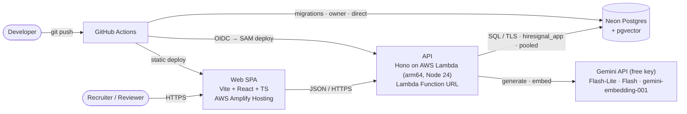
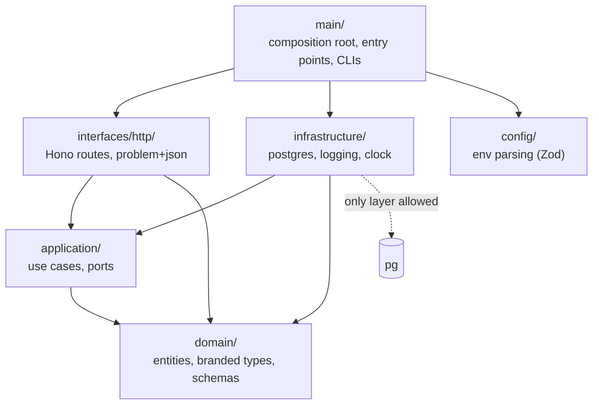
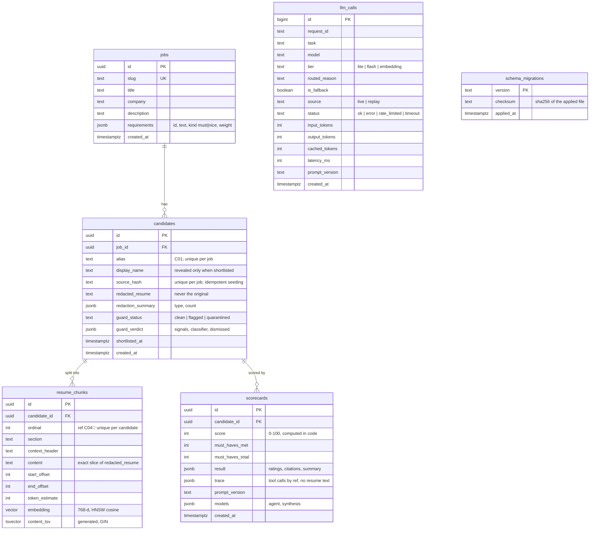

# Architecture

How HireSignal is put together. Decisions are in the [ADR index](adr/README.md), and the full design is in [SPEC.md](SPEC.md). This page grows phase by phase; as of 2026-10-08 (Phase 1) it covers the system context, the API layers and the data model.

## System context

- **One Lambda behind a Function URL** serves the whole API ([ADR 0004](adr/0004-single-lambda-behind-a-function-url.md)). The web app is a static SPA on Amplify ([ADR 0017](adr/0017-static-spa-on-amplify-with-ci-deploys.md)).
- **One Postgres database** holds the relational data, the JSONB documents, the vectors and the full-text indexes ([ADR 0005](adr/0005-neon-postgres-pgvector-only-datastore.md)). The Lambda connects as the least-privilege `hiresignal_app` role through Neon's pooler. Migrations run as the owner on the direct endpoint, **before** each code deploy ([ADR 0018](adr/0018-forward-only-migrations-before-deploy.md)).
- **The Gemini API** is wired in Phase 2.

## API layers

The API is hexagonal ([ADR 0002](adr/0002-hexagonal-architecture-with-enforced-boundaries.md)). [`.dependency-cruiser.cjs`](../.dependency-cruiser.cjs) enforces the arrows in CI.

Persistence follows ports and adapters ([ADR 0006](adr/0006-node-postgres-everywhere.md)):

| Port (`application/ports/`) | Adapter (`infrastructure/postgres/`) | Methods                                                                                       |
| --------------------------- | ------------------------------------ | --------------------------------------------------------------------------------------------- |
| `JobRepository`             | `pg-job-repository.ts`               | `upsert`, `findBySlug`, `list`                                                                |
| `CandidateRepository`       | `pg-candidate-repository.ts`         | `insertIngested` (candidate + chunks, one transaction), `findById`, `listRanked`, `shortlist` |
| `ChunkRepository`           | `pg-chunk-repository.ts`             | `hybridSearch` (vector + keyword, RRF), `getSection`, `getByRefs`                             |
| `ScorecardRepository`       | `pg-scorecard-repository.ts`         | `save`, `latestFor`                                                                           |
| `LlmCallRepository`         | `pg-llm-call-repository.ts`          | `record`, `countLiveSince` (Phase 7 adds the ops queries)                                     |
| `DatabaseProbe`             | `pg-database-probe.ts`               | `ping` (used by `GET /api/health`)                                                            |

Every row read back is parsed with a Zod schema (`*-rows.ts`) before it becomes a domain type, so JSONB that drifts from the code fails loudly at the boundary.

## Data model

The schema is [`db/migrations/0001_init.sql`](../db/migrations/0001_init.sql). [`0002_app_role_grants.sql`](../db/migrations/0002_app_role_grants.sql) gives `hiresignal_app` `select`, `insert` and `update`, with no `delete` and no DDL.

- **Quarantined candidates** keep their redacted text and verdict but never get chunks. The `IngestedCandidate` type enforces this, and every retrieval query filters them out as well.
- **Scorecards are append-only.** Re-screening adds a row, and readers take the newest one (`scorecards_candidate_latest` index).
- **`llm_calls` stores metadata only:** no prompts, resume text or model output.
